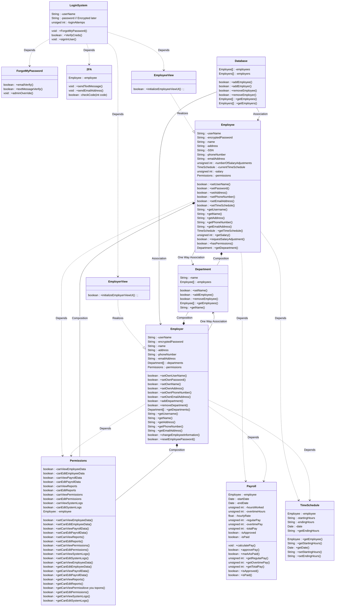

# Software-Engineering-UML-Diagram

```mermaid
classDiagram
LoginSystem ..> ForgotMyPassword : Depends
LoginSystem ..> 2FA : Depends
LoginSystem ..> EmployeeView : Depends
LoginSystem ..> EmployerView : Depends
EmployeeView ..|> Employee : Realizes
EmployerView ..|> Employer : Realizes
Database --> Employee : Association
Database --> Employer : Association
Employee --> Department : One Way Association
Employer --> Department : One Way Association
Employee ..> Permissions : Depends
Employer ..> Permissions : Depends
Department --* Employee : Composition
Department --* Employer : Composition
Permissions --* Employee : Composition
Permissions --* Employer : Composition
Employee ..> Payroll : Depends
Employer ..> Payroll : Depends
Employee ..> TimeSchedule : Depends
Employer ..> TimeSchedule : Depends


class LoginSystem {
    String : -userName
    String : -password // Encrypted later
    void : +ForgotMyPassword()
    unsiged int : -loginAttemps
    boolean : +VerifyCreds()
    void : +signInUser()
    
}

class ForgotMyPassword {
    boolean : +emailVerify()
    boolean : +textMessageVerify()
    void : +adminOverride()
}

class Employee {
    String : -userName
    String : -encryptedPassword
    String : -name
    String : -address
    String : -SSN
    String : -phoneNumber
    String : -emailAddress
    unsigned int : -numberOfSalaryAdjustments
    TimeSchedule : -currentTimeSchedule
    unsigned int : -salary
    Permissions : -permissions
    boolean : +setUserName()
    boolean : +setPassword()
    boolean : +setAddress()
    boolean : +setPhoneNumber()
    boolean : +setEmailAddress()
    boolean : +setTimeSchedule()
    String : +getUsername()
    String : +getName()
    String : +getAddress()
    String : +getPhoneNumber()
    String : +getEmailAddress()
    TimeSchedule : +getTimeSchedule()
    unsigned int : +getSalary()
    boolean : +requestSalaryAdjustment()
    boolean : +hasPermissions()
    Department : +getDepeartment()
}

class 2FA {
	Employee : -employee
	void : +sendTextMessage()
	void : +sendEmailAddress()
	boolean : checkCode(int code)
}

class Database {
	Employee[] : -employees
	Employers[] : -employers
	boolean : +addEmployee()
	boolean : +addEmployer()
	boolean : +removeEmployee()
	boolean : +removeEmployer()
	Employee[] : +getEmployees()
	Employers[] : +getEmployers()
}

class EmployeeView {
	boolean : +initializeEmployeeViewUI();
}

class EmployerView {
	boolean : +initializeEmployerViewUI();
}

class TimeSchedule {
	Employee : -employee
	String : -startingHours
	String : -endingHours
	Date : -date
	Employee : +getEmployee()
	String : +getStartingHours()
	String : +getEndingHours
	Date : +getDate()
	String : +setStartingHours()
	String : +setEndingHours()
}
class Employer {
    String : -userName
    String : -encryptedPassword
    String : -name
    String : -address
    String : -phoneNumber
    String : -emailAddress
    Department[] : -departments
    Permissions : -permissions
    boolean : +setOwnUserName()
    boolean : +setOwnPassword()
    boolean : +setOwnName()
    boolean : +setOwnAddress()
    boolean : +setOwnPhoneNumber()
    boolean : +setOwnEmailAddress()
    boolean : +addDepartment()
    boolean : +removeDepartment()
    Department[] : +getDepartments()
    String : +getUsername()
    String : +getName()
    String : +getAddress()
    String : +getPhoneNumber()
    String : +getEmailAddress()
    boolean : +changeEmployeeInformation()
    boolean : +resetEmployeePassword()
    
}

class Department {
    String : -name
    Employee[] : -employees
    boolean : +setName()
    boolean : +addEmployee()
    boolean : +removeEmployee()
    Employee[] : +getEmployees()
    String : +getName()
}

class Permissions {
    boolean : -canViewEmployeeData
    boolean : -canEditEmployeeData
    boolean : -canViewPayrollData
    boolean : -canEditPayrollData
    boolean : -canViewReports
    boolean : -canEditReports
    boolean : -canViewPermissions
    boolean : -canEditPermissions
    boolean : -canViewSystemLogs
    boolean : -canEditSystemLogs
    Employee : -employee
    boolean : +setCanViewEmployeeData()
    boolean : +setCanEditEmployeeData()
    boolean : +setCanViewPayrollData()
    boolean : +setCanEditPayrollData()
    boolean : +setCanViewReports()
    boolean : +setCanEditReports()
    boolean : +setCanViewPermissions()
    boolean : +setCanEditPermissions()
    boolean : +setCanViewSystemLogs()
    boolean : +setCanEditSystemLogs()
    boolean : +getCanViewEmployeeData()
    boolean : +getCanEditEmployeeData()
    boolean : +getCanViewPayrollData()
    boolean : +getCanEditPayrollData()
    boolean : +getCanViewReports()
    boolean : +getCanEditReports()
    boolean : +getCanViewPermissilove you topons()
    boolean : +getCanEditPermissions()
    boolean : +getCanViewSystemLogs()
    boolean : +getCanEditSystemLogs()
}
class Payroll {
    Employee : -employee
    Date : -startDate
    Date : -endDate
    unsigned int : -hoursWorked
    unsigned int : -overtimeHours
    float : -hourlyRate
    unsigned int : -regularPay
    unsigned int : -overtimePay
    unsigned int : -totalPay
    boolean : -isApproved
    boolean : -isPaid
    void : +calculatePay()
    boolean : +approvePay()
    boolean : +markAsPaid()
    unsigned int : +getRegularPay()
    unsigned int : +getOvertimePay()
    unsigned int : +getTotalPay()
    boolean : +isApproved()
    boolean : +isPaid()
}
```
